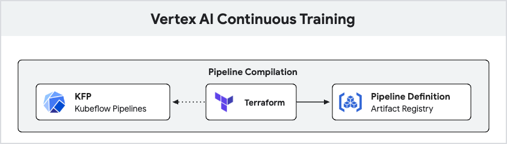
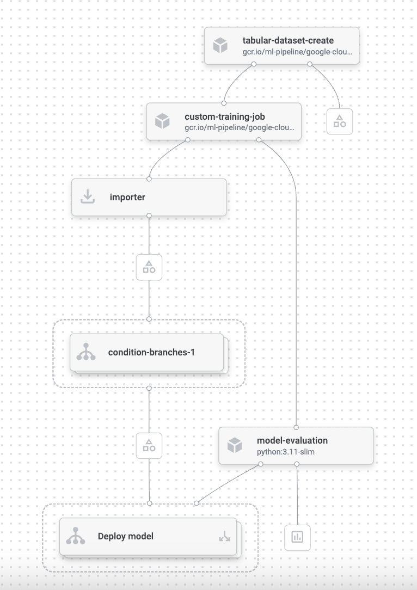
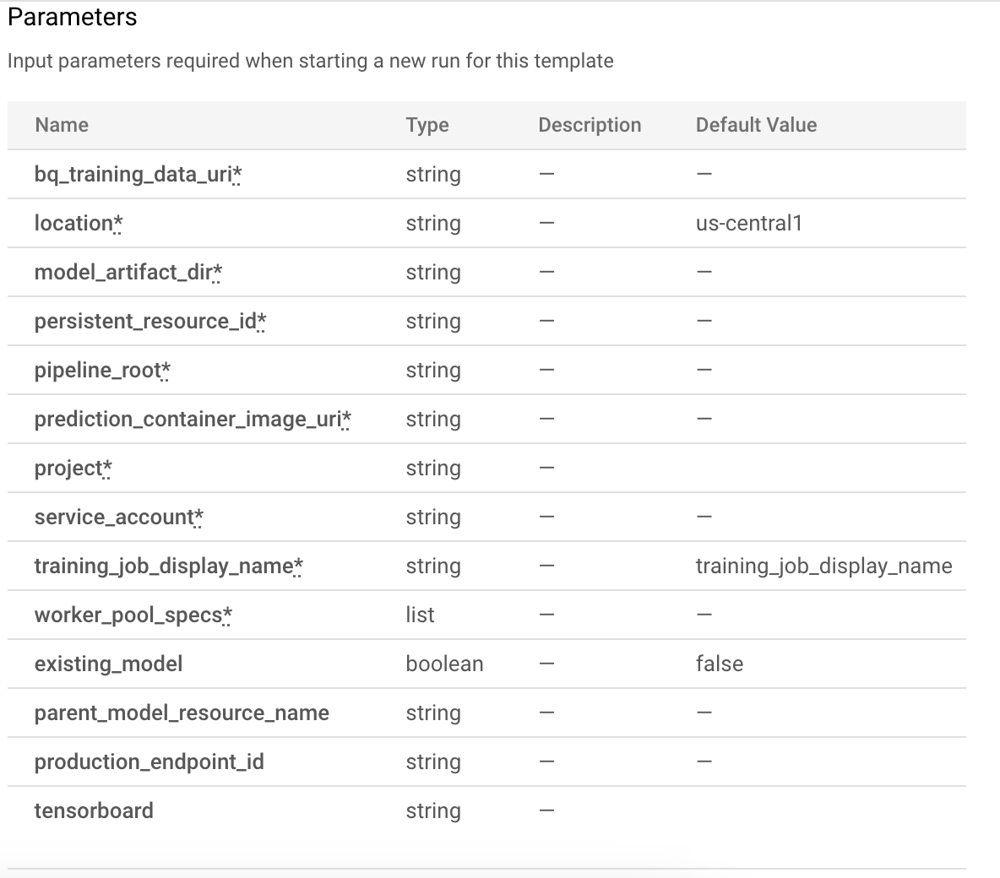
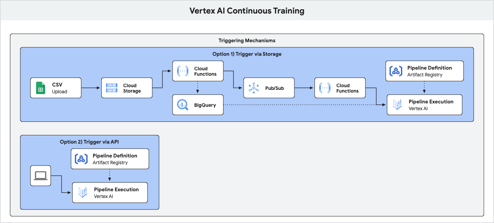
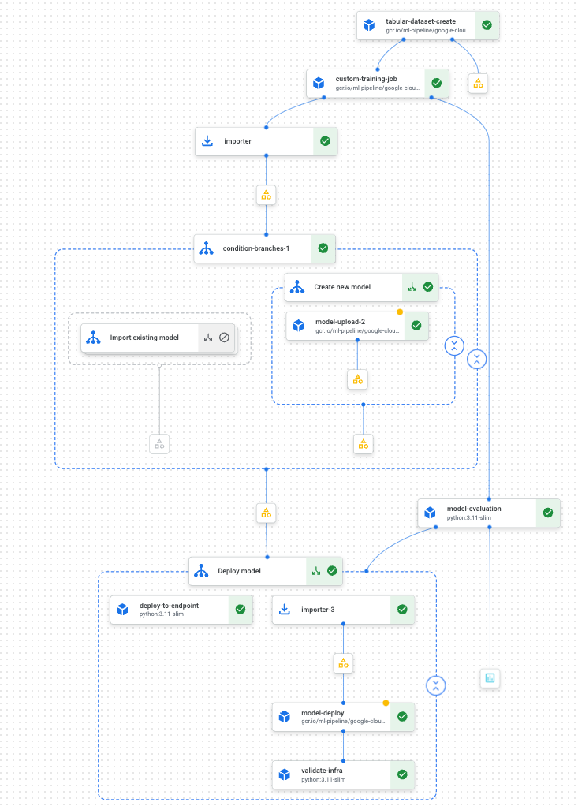
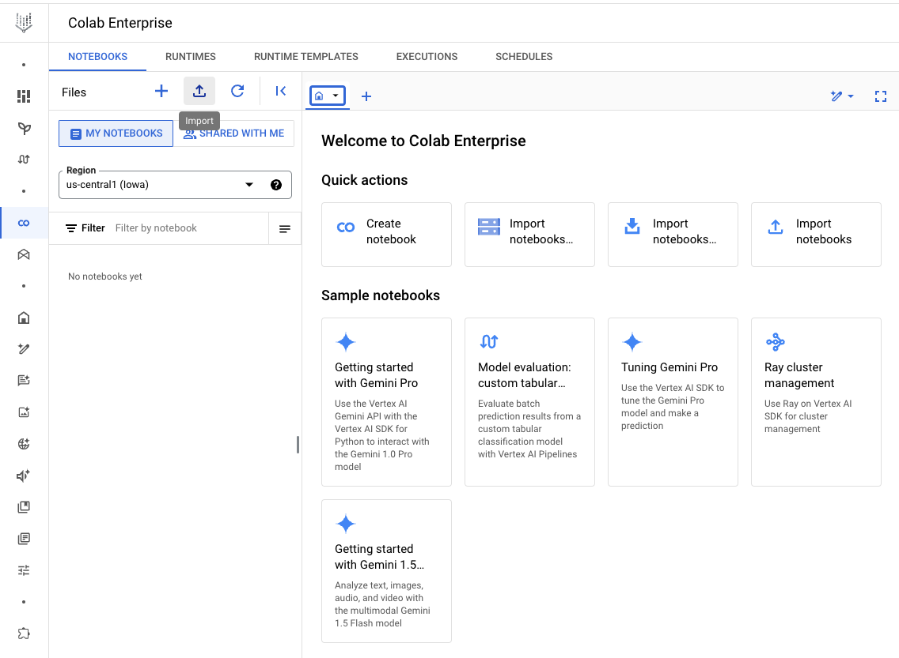
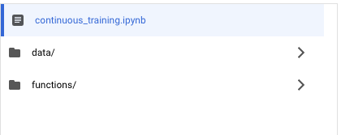
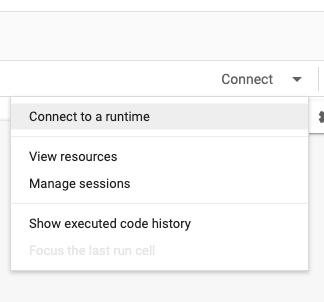
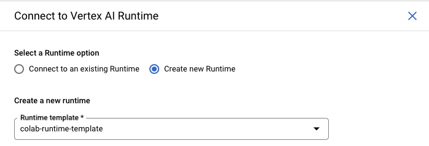

# Continuous Model Training with Vertex AI

This project demonstrates a continuous training (CT) pipeline on Vertex AI. It addresses the need for frequent model updates by incorporating new data as it becomes available, moving away from traditional scheduled batch training. The pipeline is designed to train, evaluate, and deploy models at upon availability of fresh data, ensuring that predictions remain accurate and relevant.


## Pipeline Definition



The pipeline is compiled ahead of time, using the Kubeflow Pipelines (KFP) domain-specific language (DSL). The `pipeline`, specifically [pipeline/pipeline.py](pipeline/pipeline.py) contains the DAG definition.



In order to execute the pipeline, you will need to pass the arguments:



## Pipeline Execution



The system uses a flexible, two-pronged approach to trigger the CT pipeline:

**1. Data-Driven Trigger (via Cloud Storage):**

New data uploaded as a CSV file to a designated Cloud Storage bucket automatically triggers the pipeline.  A Cloud Function performs pre-processing and loads the data into BigQuery. This function then publishes a message to a Pub/Sub topic. A second Cloud Function, subscribed to this topic, initiates the execution of the pre-built Vertex AI Pipeline stored in Artifact Registry.


**2. API-Driven Trigger:**

For on-demand retraining, an API call can directly trigger the same pre-built Vertex AI Pipeline in Artifact Registry.

Both pathways leverage the same pipeline definition, ensuring consistency and simplifying management. 

## Pipeline Stages

The Vertex AI pipeline orchestrates the end-to-end lifecycle of a machine learning model, from data ingestion and training to evaluation, deployment, and validation.

1. **Data Ingestion:** Creates a Vertex AI tabular dataset from the new data in BigQuery.
2. **Model Training:** Executes a custom training job, utilizing previous model checkpoints (if available).
3. **Model Upload:** Uploads the trained model to the Vertex AI Model Registry, creating a new model or adding a new version to an existing model.
4. **Model Evaluation:** Evaluates the trained model using predefined metrics.
5. **Conditional Deployment:** Deploys the model to a Vertex AI Endpoint only if the evaluation metrics meet specified thresholds.
6. **Infrastructure Validation:** Verifies that the newly deployed model is actively serving predictions.

The pipeline uses pre-built components and importer components to streamline the flow of artifacts between stages, accelerating the development and deployment cycle. This pipeline execution will leverage **persistent resources** *(allowlist required)* in order to speed up the pipeline. The following diagram visualizes the pipeline stages:




## Usage

This section explains how to deploy and run the demo.

### Prerequisites

1. **Google Cloud Project:** You need an active Google Cloud Project with billing enabled. If you don't have one, create one at [https://cloud.google.com/](https://cloud.google.com/).
2. **gcloud CLI:** Install the Google Cloud SDK (gcloud CLI) on your local machine. Follow the instructions at [https://cloud.google.com/sdk/docs/install](https://cloud.google.com/sdk/docs/install).
3. **Terraform:** Download and install Terraform on your local machine from [https://www.terraform.io/downloads.html](https://www.terraform.io/downloads.html). More information on using Terraform with GCP can be found [here](https://cloud.google.com/docs/terraform/terraform-overview).

### Deployment Steps

1. **Clone the Repository:**

```bash
git clone ... # add the repository URL here
cd continuous-training
```

2. **Enable Required APIs:**
Enable the necessary Google Cloud APIs for your project:

```bash
gcloud services enable cloudresourcemanager.googleapis.com serviceusage.googleapis.com --project "your-project-id"
```

3. **Configure Terraform:**
- Navigate to the `terraform` directory:

```bash
cd terraform
```

- Copy the sample Terraform variables file and update it with your project ID:

```bash
cp sample-terraform.tfvars terraform.tfvars
nano terraform.tfvars # Update 'project_id' with your Google Cloud Project ID
```

- **Customize Worker Pool Specs (Optional):** The specifications of the persistent resource worker pools provisioned can be modified by changing the [worker_pools_specs.yaml](terraform/terraform-modules/persistent_resource/worker_pools_specs.yaml) file *before* running `terraform apply`.

4. **Initialize and Deploy:**
- Initialize Terraform:

```bash
terraform init
```
- Review the deployment plan:
```bash
terraform plan
```
- Apply the Terraform configuration to deploy the application:

```bash
terraform apply
```
- **Note:** The deployment process may take a few minutes to complete.

### Running the Pipeline

1. **Navigate to Colab Enterprise:** Open [Vertex AI Colab Enterprise](Navigate to https://console.cloud.google.com/vertex-ai/colab/notebooks).
2. **Import the Notebook:** Import the `continuous_training.ipynb` notebook from the Cloud Storage bucket created by Terraform (`gs://your-project-id/continuous_training.ipynb`).
3. **Create a new runtime** Use the provided template to create your Colab Enterprise runtime.
4. **Follow the instructions within the notebook** to execute the pipeline and test the different trigger mechanisms.

<figure>
  
  <figcaption>1) Navigate to Vertex AI</figcaption>
</figure>

<figure>
  
  <figcaption>2) Import the notebook from GCS</figcaption>
</figure>

<figure>
  
  <figcaption>3) Connect to a runtime</figcaption>
</figure>

<figure>
  
  <figcaption>4) Use the runtime template</figcaption>
</figure>


## Known Issues and Limitations

This demo is intended for illustrative purposes and has the following known limitations:

* **Demo Project Recommended:** We strongly recommend running this demo in a dedicated Google Cloud project specifically created for testing. This will avoid potential conflicts with existing resources and simplify cleanup.
* **Manual Resource Cleanup:** While `terraform destroy` removes most deployed resources, some may require manual deletion. This includes: Vertex AI persistent clusters, Colab notebooks, subnetworks, BigQuery tables and datasets.
* **IAM Permissions:** The provided Terraform configuration grants broad IAM permissions for demonstration simplicity. Review and adjust these permissions to adhere to the principle of least privilege in a production environment.
* **Endpoint Deployment Limits:** Vertex AI endpoints have a limit on the number of deployed models (10). Repeated pipeline runs can exceed this limit. Manually undeploy older model versions through the Vertex AI console or API to avoid this issue.
* **Colab Networking:** The demo uses a VPC network, subnet, and Cloud NAT to provide internet access to Colab Enterprise. Adapt this configuration if your network setup differs or requires custom settings. 
* **Persisent Resource Management:** If the persistent resource is manually deleted from the project, it won't automatically be created by terraform.
* **Region Support:** The demo has been tested primarily in the `us-central1` region. While other regions may work, compatibility is not guaranteed. If using a different region, be prepared for potential adjustments.
* **Allowlist required:** At the time of writing *(November, 2024)*, the usage of persistent resources for pipeline executions are in private preview, i.e., you will need to get your project allowlisted via [this form](https://docs.google.com/forms/d/16nJthW7UHL7GTCvNT0_bM3VYcZBNOfdbXg92wQlA278/viewform) in order to use this feature.
* **Error Handling:** The demo provides basic error handling. Enhance error handling and logging for more robust operation in a production environment. Consider incorporating mechanisms for alerting and automated recovery.
* **Security Considerations:** This demo is not designed for production security requirements. Review and implement appropriate security measures, including access control, data encryption, and vulnerability scanning, before deploying any components to a production environment.

## Persistent Resource Billing
You are billed for the entire duration that a persistent resource is in a running state, regardless of whether there is a training job or a pipeline running on the persistent resource. For more details, please refer to the [documentation](https://cloud.google.com/vertex-ai/docs/training/persistent-resource-overview). In order to delete the persistent resource, please follow the steps described on the following [link](https://cloud.google.com/vertex-ai/docs/training/persistent-resource-delete).

## Authors
* Harkanwal Bedi (hsbedi@google.com)
* Rafa Carvalho (rafacarv@google.com)

## Disclaimer
This is not an officially supported Google product. The code in this repository is for demonstrative purposes only.

## Licensing
* The use of the assets contained in this repository is subject to compliance with [Google's AI Principles](https://ai.google/responsibility/principles/).
* See [LICENSE](LICENSE).
